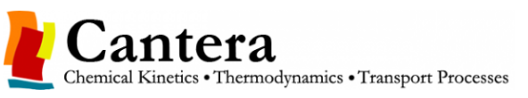

# 📚 Cantera-Python Studies 📚

  <strong style="font-size: 70%;">Figure 1:</strong> Cantera. 
  

  <strong>Source:</strong> GOODWIN; MOFFAT; SPETH (2015) [1].

Cantera is a versatile suite of object-oriented software 
tools designed for solving problems related to 
chemical kinetics, thermodynamics, and transport processes. 
It provides a range of object types representing phases 
of matter, interfaces between phases, reaction managers, 
and reactor networks for both time-dependent and steady 
one-dimensional reacting flows (GOODWIN; MOFFAT; SPETH, 2015) [1]. 

Cantera supports multiple 
programming languages, including Python, Matlab, C++, 
and Fortran 90, making it a flexible and powerful choice 
for researchers and engineers involved in modeling and 
simulating complex systems (FELDEN, 2015) [2].

## References 

[1] David G. Goodwin, Harry K. Moffat, Ingmar Schoegl, Raymond L. Speth, and Bryan W. Weber. Cantera: An object-oriented software toolkit for chemical kinetics, thermodynamics, and transport processes. https://www.cantera.org, 2023. Version 3.0.0. doi:10.5281/zenodo.8137090

[2] FELDEN, Anne. CANTERA tutorials. Cerfacs, 2015.

